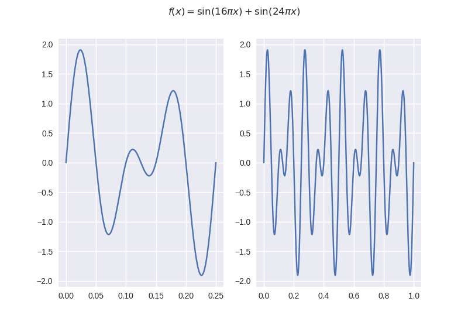
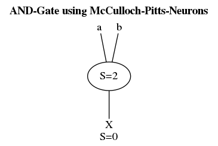
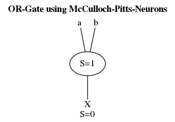
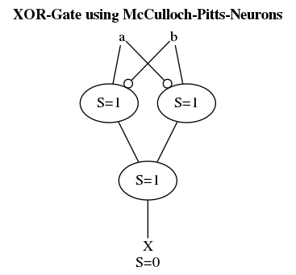
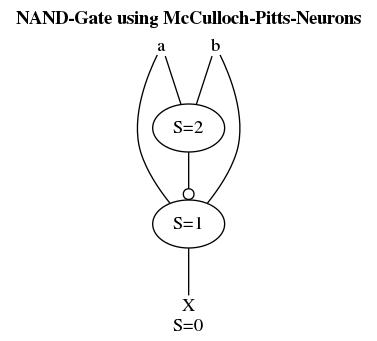
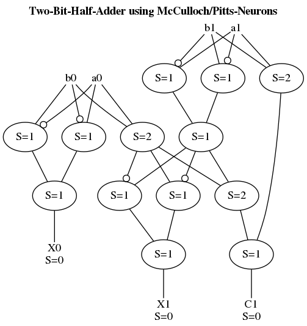

<head>
    <script type="text/javascript"
        src="https://cdnjs.cloudflare.com/ajax/libs/mathjax/2.7.5/MathJax.js">
    </script>
</head>

\(\frac{1}{8.5}\)
\[\frac{1}{8.5}\]
$\frac{1}{8.5}$
$$\frac{1}{8.5}$$

# UTF-8
Ok, so I've guest authored on a blog ([pylenin](https://www.pylenin.com/blogs/python-comparison-operators/)) recently and thought I might as well share what I've written up here.
The original blog was on comparison operators in python and how comparison based on ASCII works - My contribution is on UTF-8/why and ASCII explanation still holds for the most part.

## Excerpt from pylenin

### Enter: UTF-8

The thing is... Python doesn't actually use ASCII - most systems don't. But the explanations given above still hold true for the most part.
Now Python doesn't actually use ASCII (at least since Python 3 came out - Python 2 *did* use ASCII), but rather another encoding called **UTF-8** where UTF stands for **UCS Transformation Format** and UCS stands for **Universal Coded Character Set**. UTF-8 is what is called a **variable width encoding** and the de facto standard when it comes to **Unicode**. The beauty of UTF-8 is that it supports loads of special characters - but not at the price of making the regularly used characters (for the western world at least) need more memory. This is the *variable width* part mentioned earlier. 

#### The gritty details

If we take a look at the most common characters used, their memory representation looks like this:

```rust
'R' => 0b0101_0010 <U+0052>
's' => 0b0111_0011 <U+0073>
```

The part in angled brackets is called a **unicode code point**. It's usually written in hex - as it is here. If you compare these values to their ASCII pendant, you'll see that they're actually the same. This is another great property of UTF-8 - it's backwards compatible with ASCII and also the reason, why the above explanation still holds true for the most part. 
The code points up to `U+007F` are encoded in on byte of data with every codepoint starting with a `0`. This means there are 7 bits to represent all the ASCII symbols. If you go higher than that, you'll have a header byte that always starts with `11` and additional data bytes that start with `10`. 
Let's for example take Unicode code point `U+2705` (Called `:white_check_mark:`, it's the ✅ emoji). We get the binary represantation `0b1110_0010_1001_1100_1000_0101`, which in hex is `0xe29c85`. We can see that it's a three byte code point and can also see the initial `11` and following `10`s. UTF-8 may encode codepoints with up to 4 bytes. 

#### Potential pitfalls

So this is all fair and well and feels like it's just ASCII with more characters - the thing is, it isn't. Becaus a unicode *character* may actually consist of multiple *codepoints*. A good example for this are for example the flag emojis which consist of **regional indicator symbols**. The flag of peru for example consists of the codepoints `U+1F1F5` and `U+1F1EA`. It's two codepoints that, if the target system supports it, are rendered as a single character.
So in the end unicode and UTF-8 are fairly complicated topics - but you rarely need all this extra information, because if you just want to sort something alphabetically, you'll most likely deal with the basic ASCII character set. 

#### A bit of insider knowledge

Should you ever need the ASCII letters or something similar in your code - don't hardcode them in please. They're all available in the standardlibrary's [`string` module](https://docs.python.org/3/library/string.html).
```python3
>>> from pprint import pprint
>>> import string
>>> pprint(list(filter(lambda name: not name.startswith("_"), dir(string))))
['Formatter',
 'Template',
 'ascii_letters',
 'ascii_lowercase',
 'ascii_uppercase',
 'capwords',
 'digits',
 'hexdigits',
 'octdigits',
 'printable',
 'punctuation',
 'whitespace']
```

#### Resources
* [Python docs on comparisons of sequences](https://docs.python.org/3/tutorial/datastructures.html#comparing-sequences-and-other-types)
* [Python docs on unicode](https://docs.python.org/3/howto/unicode.html)
* [Wikipedia Article on UTF-8](https://en.wikipedia.org/wiki/UTF-8)
* [Wikipedia Article on variable width encoding](https://en.wikipedia.org/wiki/Variable-width_encoding)
* [Great talk on emoji/unicode in German](https://youtu.be/73VEB2zr4HU)
* [Computerphile video on unicode](https://youtu.be/MijmeoH9LT4)

---
---

# On the periodicity of the sums of sines

###### 20.06.19

Ok so I've thought about this before because wolfram-alpha for example says that a function like the one in the following plot isn't periodic:  
  
Which, just from looking at the plot, seems wrong. Calculating specific values also seems to support that it's a periodic function. So I've set out to prove that they're wrong.
<a href="./media/periodicity.pdf" target="_blank">PDF with proof</a>
If you find anything wrong with the proof please let me know.

**EDIT**: Turns out that wolfram alpha actually seems to do it right but is really picky about how you plug the numbers in.  
For example: Take \(\sin(8.5 \cdot 2 \pi x) + \sin(17 \cdot 2 \pi x)\).
Plugging this in as [`period of sin(8.5*2*pi*x) + sin(17*2*pi*x)`](https://www.wolframalpha.com/input/?i=period+of+sin(8.5*2*pi*x)+%2B+sin(17*2*pi*x)) leads WA to say that it's not periodic. It however thinks differently when you plug the exact same thing in as [`period of sin(17*pi*x) + sin(34*pi*x)`](https://www.wolframalpha.com/input/?i=period+of+sin(17*pi*x)+%2B+sin(34*pi*x)). It now says that it's periodic in $\frac{2}{17}$. Using the methods from my proof we get $\frac{1}{8.5}$ which of course is the exact same thing.  
But if we go ahead and add decimal points to the numbers in our WA formula like this [`period of sin(17.0*pi*x) + sin(34.0*pi*x)`](https://www.wolframalpha.com/input/?i=period+of+sin(17.0*pi*x)+%2B+sin(34.0*pi*x)) WA is back to thinking that it's not a periodic function. This probably comes down to it not going symbolically here but rather using floating point arithmetic. We can also see this at work when comparing [`plot sin(17*pi*x) - sin(2*8.5*pi*x)`](https://www.wolframalpha.com/input/?i=plot+sin(17*pi*x)+-+sin(2*8.5*pi*x)) and [`plot sin(17.0*pi*x) - sin(2*8.5*pi*x)`](https://www.wolframalpha.com/input/?i=plot+sin(17.0*pi*x)+-+sin(2*8.5*pi*x)). One of them gives the expected plot - the other one however...gives just about zero but with bumps every now and then. Just goes to show that you should always consider the capabilities of the systems you're using.

---
---

# Human Resource Machine *XASM*

###### 10.06.19

Ok, so I came across a game called Human Resource Machine last week and blasted through it fairly quickly (I can only recommend it). The game basically is programming a sort of graphical assembly and the sole reason I'm writing about it here is: it supports importing and exporting and exporting source code.

## Instruction set

The HRM asm has a register based instruction set with only ten instructions:

* **Inbox**: Fetch a new input block (an int between -999 and 999 or a char) from the input stream
* **Outbox**: Write your current accumulator to the output stream
* **Copyfrom** rs: Copy to the accumulator from register rs
* **Copyto** rd: Copy the accumulator to register rd
* **Add** rs: Add rs to the accu
* **Sub** rs: Subtract rs from the accu
* **Bumpup** rd: Increment rd and load to accu
* **Bumpdn** rd: Decrement rd and load to accu
* **Jump** m: Jump to m
* **Jumpz** m: Jump to m if accu is zero
* **Jumpn** m: Jump to m if accu is less than zero

and also supports pointers (surrrounding a register with brackets makes it a pointer) and single line comments.
Now this is great, but I kinda wanted to do more complicated stuff/ do complicated stuff more easily... so naturally I wrote my own language that offers just slightly more abstraction over HRM's vanilla language and compiles to native HRM ASM.

## Features of *XASM*

My extended asm (I dubbed it *XASM*) has a new language feature that allows defining the available amount of memory. You then can easily use variables or essentially named registers without having to worry about their actual adresses - they're distributed automatically. I didn't add any new instructions because that would kinda take the fun out of the game.  

## Implementation

[When it got to implementing the whole thing](https://github.com/SV-97/HumanResourceMachine) I started by writing it in Python which worked great. But when I already had the tokenizer etc. I thought that I might as well think of a bytecode, compile the whole thing and build a VM for it. I started doing this in python but then decided to switch over to Rust which seems to be so much nicer when it comes to building language applications (though I think the new walrus operator coming with Python 3.8 will bring some remedy in that domain). I implemented the following architecture:  

  

It overall was a fairly straightforward process - I stumbled a bit over the pointers but I had to use 16-bit numbers anyway (With 8-bit jumps - I don't think anyone will create programs that are over 255 instructions long) for the operands, so I just used one bit of those for the pointer.  

I mapped the original instructions 1:1 to bytecode and wrote a register machine to execute the whole thing.  
Because I wanted to be able to have some color in the output I also implemented a "logging" system with a *colored!*-macro that allows applying most of the ANSI-codes to format strings and is also easily extendable via a trait if I did miss something.  
Overall this was a really fun project and great exercise in using Rust - I'm kinda tempted to reimplement it in C or more likely C++, just to see how much more of a pain that would be, but I don't think I'll actually do that.  

---
---

# McCulloch/Pitts neuron model

###### 26.05.19

So I came across the McCulloch/Pitts (I'll just call it Mcp) neuron model while reading on ANNs today. The Mcp is a comparatively easy model that doesn't have a concept of weights. The neurons are of a binary nature. They fire if the sum of their inputs exceed a treshold value (called S in the following). They also have inhibitor inputs that prevent the neuron from firing completely if they're present.
Naturally I chose to [implement it in python](https://github.com/SV-97/Py3-Private/tree/master/P3_060_NeuroComputingBasics) and play around with it.

## Basic logic

I started off with creating AND and OR gates from the neurons which worked great.

|                         AND-Gate |                        OR-Gate |
|:--------------------------------:|:------------------------------:|
|  |  |

I just connected normal inputs to the node's inputs, and negated ones to the inhibition. This fails because that way the treshold value isn't reached and it can't possibly fire with the inhibitor being > 0.
While it took me some time to figure this out I was able to quickly adapt to it and create a few more complex gates after I did.

|                        XOR-Gate |                          NAND-Gate |
|:-------------------------------:|:----------------------------------:|
| |  |

## Modelling DSL

After I was done playing around with it I thought that this was a bit short of an "exploration" and constructing the nets by hand like this was too big of a hassle and decided to write a small DSL to automate it.
The language looks like this

```desc
title: XOR-Gate using McCulloch-Pitts-Neurons 
in: a b 
out: X 
c: 1 
d: 1 
e: 1 
a -- c 
b -o c 
a -o d 
b -- d 
d -- e 
c -- e 
e -- X
```

Which of course is fairly minimalistic but enough for what I wanted to do here. It also transpiles to graphviz-dot to generate these graphs I've had in here. The language essentially comes down to declaring inputs with "in:", outputs with "out:", internal neurons with their name followed by their treshold and connections with  "--" for regular links and "-o" for inhibitions.
I've also tried using regular expressions for parsing which was a first but worked out fairly well ( even though the code isn't exactly beautiful ).

Just for the fun of it I also built a two bit half-adder using these neurons and I haven't tested it yet, but I think it works (In case anyone is interested: it took about 50 lines of my descriptor-code).

## Two-Bit-Half-Adder



---
---

# Other stuff

* [CAD Services](https://sites.google.com/view/sv-cad/) - Where I post everything regarding my CAD work.
* [Book index](./books.md) - Books I'm currently reading, have already finished, on backlog etc. you get the notion.
* [About me](./about.md)
  
---
